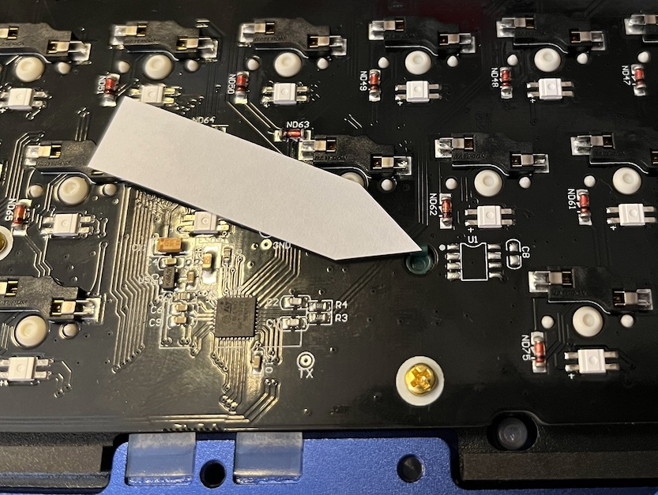

# Not Keychron Q1 - How to compile this source

This code in not intended to be compiled as standalone - rather it needs to be incorporated in the source base of the [`qmk/qmk_firmware`](https://github.com/qmk/qmk_firmware) project.

Furthermore - the Keychron Q1 board referred to herein will ***NOT*** work on either the [`keychron/qmk_firmware:playground`](https://github.com/keychron/qmk_firmware/tree/playground) repo/branch, nor the core [`qmk/qmk_firmware:master`](https://github.com/qmk/qmk_firmware/tree/master) repo/branch *(unless it has the EEPROM added on)*

> :warning: : Do not compile this code from the Keychron's QMK fork.


## About

This code base supports the entire Keychron Q1V2 board fleet *(a.k.a. "Q1 STM32")* with one code base and one VIA sideload file.  To compile you will need to either:

1. **EFL and Wear-Leveling**: Compile off the [`qmk/qmk_firmware:develop`](https://github.com/qmk/qmk_firmware/tree/develop) repo/branch, that includes the EFL *(Embedded Flash Library)* driver, and the "wear-leveling algorithm" added by @tzarc - added with PR's [#16996](https://github.com/qmk/qmk_firmware/pull/16996), [#17651](https://github.com/qmk/qmk_firmware/pull/17651), and  [#17661](https://github.com/qmk/qmk_firmware/pull/17661).

    ..or..

2. **External EEPROM**: Solder on an 8-SOIC *[footprint]*, EEPROM Memory I²C IC, and then compile off the QMK core repo, i.e. [`qmk/qmk_firmware`](https://github.com/qmk/qmk_firmware/tree/master)

    Current IC's tested include:

    * **`M24C32-FMN6TP`**: 32Kbit (8 x 4Kbit) I²C 1MHz 450ns 8-SOIC EEPROM module *(total 4096 bytes)*

    > :shrug: : IMO this is the better method


## Why?

When the predecessor of QMK (TMK) was first written, it was written for the Atmel AVR chip, most commonly the [**ATmega32U4**](https://www.microchip.com/en-us/product/ATmega32U4).  This MCU *(MicroController Unit)* featured 32KB Flash *(where the firmware resides)*, ***and*** 1KB EEPROM *(where the dynamic keymap used by VIA and some other variable, but persistent, settings are stored)*.

Evolution of QMK moved on to the ChibiOS/HAL based STMicroelectronics STM32 class of ARM Cortex MCU's .. and in the case of the Q1 this is the [**STM32L432**](https://www.st.com/en/microcontrollers-microprocessors/stm32l432kc.html) that featured 256KB Flash *(8x more than the AVR)*, but no EEPROM.  To account for the lack of EEPROM, QMK has written in an EFL driver *(that uses a portion of the Flash as an emulated EEPROM)*.  This works across a plethora of ARM based MCU's ... **but this method has a caveat**: Flash is not as endurable as EEPROM.  For example, the STM32L432 spec states that the MCU has a minimum write endurance of 10,000 cycles, where as if you compare it to the M24C32-FMN6TP EEPROM IC module, it's endurance is 4,000,000 write cycles.  This means that, by adding an external EEPROM IC to compliment the MCU, you get a keyboard that can handle 400x more write cycles to it's dynamic keymap / settings storage space.

Now, if you're a YouTuber that uses his "sponsored" KB for 3 days and then stores it - then this is all meaningless and the Emulated EEPROM will do just fine.  But if you've built an end-game unit that you intend to use daily for the next 5-7 years, then this would be something you'd be interested in.

Luckily, Keychron's design always accounted for an external I²C EEPROM IC, but it is not populated during production.



All that is needed is to solder on:
1. a compatible 8-SOIC *[footprint]* I²C EEPROM module IC
2. a 100nF / 0.1μF 0603 *[footprint]* Capacitor

> :information_source: : If you're compiling for the EFL driver you don't need to solder anything.

## Preparation

1. If you haven't already create an instance of the source code on your computer - you'll want to use either a fork of, or a clone of, one of the following:

    * [`qmk/qmk_firmware:develop`](https://github.com/qmk/qmk_firmware/tree/develop) - The `develop` branch at QMK.  *(Works for both external EEPROM and EFL compile.)*
    * [`qmk/qmk_firmware`](https://github.com/qmk/qmk_firmware) - The core QMK code base.  *(Only works for the external EEPROM compile, __as of July 2022__. After the next quarterly merge this should work on the EFL too.)*

2. Navigate to the root of the repo's folder.

3. Create and activate a new **branch**. *(Never write to the `master` or `main` branch!)*

    > :stop_sign:	: If you don't know how to do that then stop here - you may need to brush up on your Git skills.

4. Either:

    a. Create a symbolic link to this repo pulled onto your computer;

      - Mac:

        ```sh
        mkdir keyboards/notkeychron
        ln -s /path/to/this/repo keyboards/notkeychron/q1
        ```

      - Win:

        ```cmd
        mkdir keyboards/notkeychron
        mklink /D \path\to\this\repo keyboards/notkeychron/q1
        ```


        .. or ..

    b. Create a "submodule" to this repo and then move the module to the correct folder;

      - Mac & Win

        ```sh
        git submodule add https://github.com/vinorodrigues/not_keychron_q1
        mkdir keyboards/notkeychron
        git mv not_keychron_q1 keyboards/notkeychron/q1
        ```

        > :shrug: : IMO this is the better method

5.  That should be it.  You're ready to compile.

